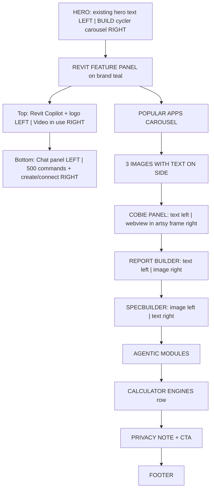

# Redesign Sandbox Home Page

## Brand

- Brand Teal: `#156082` (the only brand color)
- Gradient: keep existing gradient treatment, see how it turns out
- Soft white background: `#f8f9fb` (off-white, not pure `#fff`)
- Text: existing `--text` / `--text-muted` CSS variables

## What changes

Only `dist/index.html` (generated from `templates/home.html` + `scripts/patch-dist-home.mjs`). The live SPA at `/index.html` is NOT touched.

## Page layout (follows user instructions literally)



### Section 1 — Hero

The existing hero text stays exactly where it is (LEFT column). The chat panel is REMOVED from here and moved down to the Revit feature panel.

In its place (RIGHT column): a BUILD text cycler carousel. "BUILD" stays fixed, and product names cycle vertically underneath: MEP, Specifications, Drainage, COBie, Schedules, Reports, Schematics, QA, Lighting, Ventilation, Heating, Fire Alarms. Pure CSS `@keyframes` animation.

### Section 2 — Revit Copilot Feature Panel

Full-width container on brand teal (`#156082`) gradient background.

**Top row (2 columns):**

```
|                               |                           |
|  REVIT COPILOT                |   VIDEO IN USE            |
|  [APP LOGO]                   |                           |
|  tagline + CTA                |                           |
|                               |                           |
```

- Left: Revit Copilot title, app logo from `images/app-logos/revit-copilot.png`, tagline, CTA
- Right: video placeholder (dark gradient box, same `.scene-3d` pattern)

**Bottom row (2 columns):**

```
|  chat panel                   |  500 commands             |
|  (the ACTUAL MEP chat moved   |  Create your own          |
|   from the hero — same        |  Connect your own plugin  |
|   draggable chat block)       |                           |
```

- Left: the existing lifted MEP chat block (moved here from hero, same artsy painting frame, same drag, same everything — just repositioned)
- Right: 500 commands card with "Create your own" and "Connect your own plugin" messaging

### Section 3 — Popular Apps Carousel

Horizontal scroll cards.

**Current apps:** Specbuilder, CoBie Builder, Schedule Builder, QA Manager, Schematic Generator, 2D to 3D MEP and furniture, Adelphos Chat, Document Controller, Excel Plugin, Word Plugin, Report Builder, Clash Solver.

**Coming After divider, then:** 2D to 3D FloorPlan from PDF, Plantroom Generator, AutoRouting tool - pipework, AutoCAD CoPilot, Report Builder - New IESVE Modules and AI Modelling Package, Arch Floorplan Generation and Editing Features, MEP Design Modules and Editing Features.

**"See roadmap for more" link** at the end.

### Section 4 — 3 Images with Text on Side

Inspired by the "Automated 3D Model Creation" section on the existing live home page. 3 rows, alternating layout.

**Clash Solver / 3D model export:** kept exactly as we have it now. Put it in a container with the same artsy background as the chat panel. Text on the side describing the feature.

### Section 5 — COBie Panel

Take the chat panel container (artsy background frame) and put the COBie webview inside it. Keep it on light mode. Text on left, panel on right.

### Section 6 — Report Builder + Specbuilder

Two large sections, alternating layout. "Create your own templates — sell your own templates" messaging.

```
|  REPORT BUILDER    |  STATIC PICTURE  |
|  [APP LOGO]        |                  |

|  STATIC PICTURE    |  SPECBUILDER     |
|                    |  [APP LOGO]      |
```

### Section 7 — Agentic Modules

Card grid of the agentic/managed services.

### Section 8 — Calculator Engines

Horizontal row of badges: SAP, EPC, SBEM, Cable Calculations, Lighting Calculations, Thermal Calculations, Pipe and Duct Sizing.

### Section 9 — Privacy Note

"No data stored, no chase ups, no spam, and all uploaded data on AWS Azure backend — we don't see it."

Final CTA.

## Implementation

All done in `scripts/patch-dist-home.mjs`. The key change: the chat panel block moves from the hero section down into the Revit Copilot feature panel. The hero's right column becomes the BUILD text cycler. Everything else is new sections added below.

## NOT in this phase

- Individual app/feature pages (phase 2)
- Navigation restructure / features dropdown (phase 2)
- Live SPA (`/index.html`)
